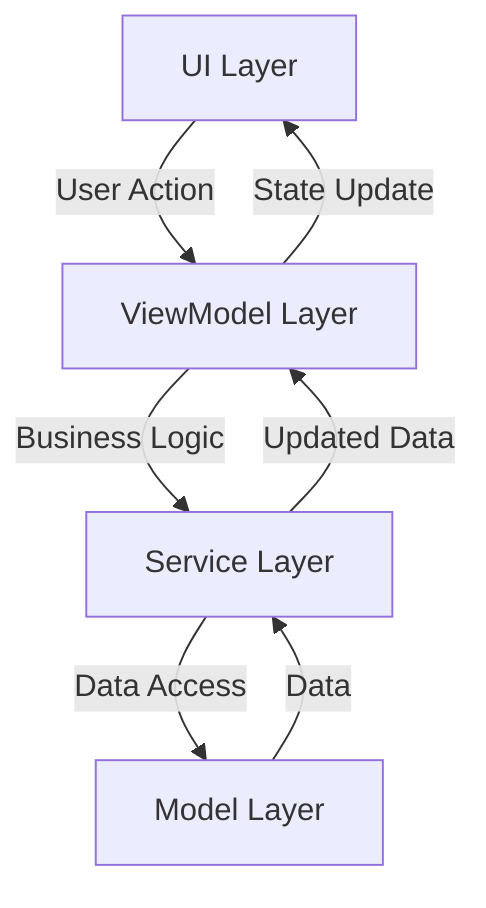

# Arquitectura de Golo App

Golo App sigue una arquitectura MVVM (Model-View-ViewModel) con Clean Architecture, organizada en capas claramente definidas.

## Capas de la Aplicación

```
lib/
├── models/         # Capa de Dominio
│   ├── insumo.dart
│   ├── proveedor.dart
│   ├── plato.dart
│   ├── intermedio.dart
│   └── evento.dart
├── repositories/   # Capa de Datos
│   ├── insumo_repository.dart
│   ├── proveedor_repository.dart
│   ├── plato_repository.dart
│   ├── intermedio_repository.dart
│   ├── insumo_utilizado_repository.dart
│   └── intermedio_requerido_repository.dart
├── services/       # Capa de Servicios
│   ├── insumo_service.dart
│   ├── proveedor_service.dart
│   └── plato_service.dart
├── viewmodels/     # Capa de Presentación
│   ├── insumo_viewmodel.dart
│   ├── proveedor_viewmodel.dart
│   └── plato_viewmodel.dart
├── ui/            # Capa de UI
│   ├── screens/
│   ├── widgets/
│   ├── theme/
│   └── navigation/
└── core/          # Utilidades y Configuración
    ├── utils/
    └── config/
```

### 1. Capa de Dominio (Models)

#### Responsabilidades
- Definición de estructuras de datos del dominio
- Lógica de negocio
- Validación de datos
- Serialización/Deserialización

#### Modelos Principales
1. **Insumo**: Representa los ingredientes básicos
   - Códigos únicos
   - Categorías
   - Proveedores
   - Precios y unidades

2. **Proveedor**: Representa las empresas proveedoras
   - Información de contacto
   - Estado activo/inactivo
   - Relación con insumos

3. **Plato**: Representa los platos del menú
   - Componentes (insumos e intermedios)
   - Costos y precios
   - Categorías

4. **Intermedio**: Representa preparaciones intermedias
   - Componentes requeridos
   - Costos de producción
   - Tiempo de preparación

5. **Evento**: Representa eventos especiales
   - Clientes y contactos
   - Platos seleccionados
   - Presupuestos y costos
   - Requisitos especiales

### 2. Capa de Datos (Repositories)

#### Responsabilidades
- Acceso a la base de datos
- Manejo de caché
- Filtrado y búsqueda
- Manejo de errores

#### Características
- Implementación con Firestore
- Consultas eficientes
- Caché en memoria
- Manejo de estados
- Búsqueda parcial de nombres
- Filtrado por categorías y proveedores

### 3. Capa de Servicios

#### Responsabilidades
- Lógica de negocio
- Coordinación entre capas
- Validaciones de negocio
- Cálculos y procesamiento

### 4. Capa de Presentación (ViewModels)

#### Responsabilidades
- Estado de la UI
- Manejo de eventos
- Transformación de datos
- Comunicación con UI

### 5. Capa de UI

#### Estructura
- **Screens**: Pantallas principales
- **Widgets**: Componentes reutilizables
- **Theme**: Temas de diseño
- **Navigation**: Navegación

### 6. Core

#### Utilidades
- Extensions y helpers
- Validaciones
- Formateo
- Utilidades de UI

#### Configuración
- Firebase
- Temas
- Navegación

## Patrones Implementados

- MVVM Pattern
- Repository Pattern
- Singleton Pattern
- Builder Pattern
- Factory Pattern
- Observer Pattern
- Strategy Pattern
- Decorator Pattern

## Manejo de Estados

- Estado de UI
- Estado de datos
- Estado de carga
- Manejo de errores

## Manejo de Errores

- Manejo consistente de errores
- Mensajes de usuario
- Logging
- Manejo de excepciones

## Características Técnicas

- Firebase como backend
- Provider para estado
- Flutter para UI
- Windows SDK para compilación nativa
- Material Design 3
- Responsive Design
- Temas claro/oscuro
- Navegación moderna

## Flujo de Datos



## Gestión de Estado

### Provider
- Gestión de estado local
- Inyección de dependencias
- Actualización de UI

```dart
MultiProvider(
  providers: [
    ChangeNotifierProvider(create: (_) => NavigationState()),
    Provider<PlatoService>(create: (_) => PlatoService()),
    ChangeNotifierProxyProvider<PlatoService, PlatoViewModel>(
      create: (context) => PlatoViewModel(context.read<PlatoService>()),
      update: (context, service, previous) => previous ?? PlatoViewModel(service),
    ),
  ],
)
```

## Navegación

### Sistema de Navegación
- Basado en índices para pantallas principales
- Navegación adaptativa
- Manejo de rutas nombradas

```dart
class NavigationState extends ChangeNotifier {
  int _currentIndex = 0;
  
  void setCurrentIndex(int index) {
    _currentIndex = index;
    notifyListeners();
  }
}
```

## Integración con Firebase

### Servicios Firebase
- Firestore para datos
- Authentication para usuarios
- Storage para archivos
- Cloud Functions para lógica serverless

### Patrón de Acceso a Datos
```dart
class FirebaseService<T> {
  final CollectionReference collection;
  
  Future<T> get(String id);
  Future<List<T>> getAll();
  Future<void> set(String id, T data);
  Future<void> delete(String id);
}
```

## Principios SOLID

### Single Responsibility
- Cada clase tiene una única responsabilidad
- Separación clara de concerns

### Open/Closed
- Extensión a través de herencia y composición
- Uso de interfaces y clases abstractas

### Liskov Substitution
- Subclases pueden sustituir a sus clases base
- Contratos bien definidos

### Interface Segregation
- Interfaces pequeñas y específicas
- Clientes no dependen de interfaces que no usan

### Dependency Inversion
- Dependencia de abstracciones
- Inyección de dependencias

## Patrones de Diseño Utilizados

### Creacionales
- Factory Method
- Builder
- Singleton

### Estructurales
- Adapter
- Composite
- Decorator

### Comportamiento
- Observer
- Strategy
- Command

## Testing

### Niveles de Testing
1. Unit Tests
2. Widget Tests
3. Integration Tests

### Estructura de Tests
```
test/
├── unit/
│   ├── models/
│   ├── services/
│   └── viewmodels/
├── widget/
└── integration/
```

## Seguridad

### Autenticación
- Firebase Authentication
- Roles y permisos
- Tokens JWT

### Reglas de Firestore
```javascript
rules_version = '2';
service cloud.firestore {
  match /databases/{database}/documents {
    match /{document=**} {
      allow read, write: if request.auth != null;
    }
  }
}
```

## Optimización

### Rendimiento
- Lazy loading
- Caché de datos
- Paginación

### Memoria
- Dispose de recursos
- Limpieza de listeners
- Gestión de imágenes

## Manejo de Errores

### Estrategia
1. Captura en capa más baja posible
2. Propagación controlada
3. Presentación amigable al usuario

### Tipos de Errores
```dart
abstract class AppError extends Error {
  final String message;
  final String? code;
}

class NetworkError extends AppError {...}
class ValidationError extends AppError {...}
class AuthError extends AppError {...}
```

## Convenciones de Código

### Nombrado
- CamelCase para clases
- snake_case para archivos
- lowerCamelCase para variables y métodos

### Estructura de Archivos
- Un widget por archivo
- Nombres descriptivos
- Organización por feature

## Documentación

### Código
- Documentación de API
- Comentarios explicativos
- Ejemplos de uso

### Archivos
- README.md
- CHANGELOG.md
- API.md
- SETUP.md
