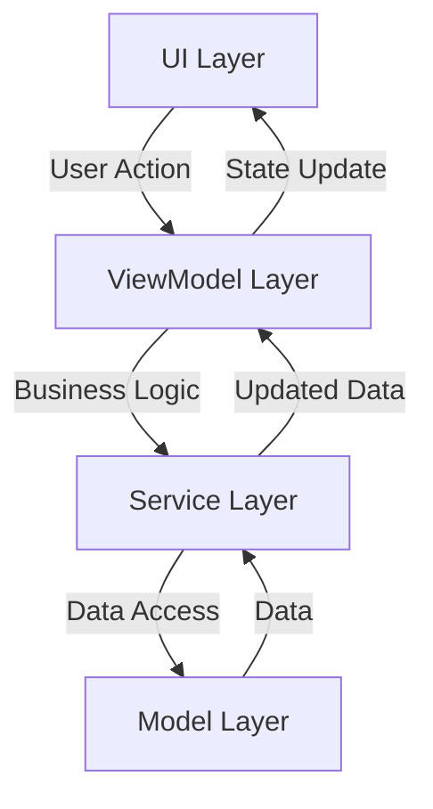

# Arquitectura de Golo App

## Visión General

Golo App sigue una arquitectura MVVM (Model-View-ViewModel) con Clean Architecture, organizada en capas claramente definidas.

## Capas de la Aplicación

```
lib/
├── models/         # Capa de Datos
├── services/       # Capa de Servicios
├── viewmodels/    # Capa de Presentación
├── ui/            # Capa de UI
└── core/          # Utilidades y Configuración
```

### 1. Capa de Datos (Models)

#### Responsabilidades
- Definición de estructuras de datos
- Lógica de negocio básica
- Validación de datos
- Serialización/Deserialización

#### Patrones Implementados
- Value Objects
- Data Transfer Objects (DTOs)
- Immutable Objects
- Builder Pattern

#### Modelo de Datos Actualizado

El modelo de datos se ha actualizado para reflejar la nueva estructura de modelos y el sistema de cálculo de costos:

1. **Plato (Dish)**
   - Información básica del plato y categorización
   - Enlaces a intermediarios requeridos a través de IntermedioRequerido
   - Cálculo de costos basado en intermediarios requeridos

2. **Evento (Event)**
   - Gestión de eventos y reservas
   - Enlaces a platos a través de PlatoEvento
   - Rastrea el estado y detalles del evento

3. **IntermedioRequerido (Required Intermediate)**
   - Componentes intermedios requeridos para platos
   - Enlaces platos a sus preparaciones requeridas
   - Mantiene cantidades de intermediarios

4. **InsumoUtilizado (Used Ingredient)**
   - Ingredientes utilizados en intermediarios
   - Enlaces ingredientes a sus intermediarios
   - Mantiene cantidades de ingredientes

5. **PlatoEvento (Event Dish)**
   - Enlaces platos a eventos
   - Rastrea cantidades por evento
   - Mantiene relaciones entre platos y eventos

### 2. Capa de Servicios

#### Responsabilidades
- Acceso a datos
- Lógica de negocio compleja
- Integración con Firebase
- Caché y persistencia

#### Patrones Implementados
- Repository Pattern
- Singleton
- Factory Method
- Strategy Pattern

### 3. Capa de Presentación (ViewModels)

#### Responsabilidades
- Lógica de presentación
- Estado de la UI
- Transformación de datos
- Manejo de eventos

#### Patrones Implementados
- Observer Pattern (ChangeNotifier)
- Command Pattern
- State Pattern
- Proxy Pattern

### 4. Capa de UI

#### Responsabilidades
- Widgets y vistas
- Manejo de entrada de usuario
- Navegación
- Temas y estilos

#### Patrones Implementados
- Composite Pattern (Widget Tree)
- Builder Pattern
- Decorator Pattern
- Strategy Pattern

## Flujo de Datos



## Gestión de Estado

### Provider
- Gestión de estado local
- Inyección de dependencias
- Actualización de UI

```dart
MultiProvider(
  providers: [
    ChangeNotifierProvider(create: (_) => NavigationState()),
    Provider<PlatoService>(create: (_) => PlatoService()),
    ChangeNotifierProxyProvider<PlatoService, PlatoViewModel>(
      create: (context) => PlatoViewModel(context.read<PlatoService>()),
      update: (context, service, previous) => previous ?? PlatoViewModel(service),
    ),
  ],
)
```

## Navegación

### Sistema de Navegación
- Basado en índices para pantallas principales
- Navegación adaptativa
- Manejo de rutas nombradas

```dart
class NavigationState extends ChangeNotifier {
  int _currentIndex = 0;
  
  void setCurrentIndex(int index) {
    _currentIndex = index;
    notifyListeners();
  }
}
```

## Integración con Firebase

### Servicios Firebase
- Firestore para datos
- Authentication para usuarios
- Storage para archivos
- Cloud Functions para lógica serverless

### Patrón de Acceso a Datos
```dart
class FirebaseService<T> {
  final CollectionReference collection;
  
  Future<T> get(String id);
  Future<List<T>> getAll();
  Future<void> set(String id, T data);
  Future<void> delete(String id);
}
```

## Principios SOLID

### Single Responsibility
- Cada clase tiene una única responsabilidad
- Separación clara de concerns

### Open/Closed
- Extensión a través de herencia y composición
- Uso de interfaces y clases abstractas

### Liskov Substitution
- Subclases pueden sustituir a sus clases base
- Contratos bien definidos

### Interface Segregation
- Interfaces pequeñas y específicas
- Clientes no dependen de interfaces que no usan

### Dependency Inversion
- Dependencia de abstracciones
- Inyección de dependencias

## Patrones de Diseño Utilizados

### Creacionales
- Factory Method
- Builder
- Singleton

### Estructurales
- Adapter
- Composite
- Decorator

### Comportamiento
- Observer
- Strategy
- Command

## Testing

### Niveles de Testing
1. Unit Tests
2. Widget Tests
3. Integration Tests

### Estructura de Tests
```
test/
├── unit/
│   ├── models/
│   ├── services/
│   └── viewmodels/
├── widget/
└── integration/
```

## Seguridad

### Autenticación
- Firebase Authentication
- Roles y permisos
- Tokens JWT

### Reglas de Firestore
```javascript
rules_version = '2';
service cloud.firestore {
  match /databases/{database}/documents {
    match /{document=**} {
      allow read, write: if request.auth != null;
    }
  }
}
```

## Optimización

### Rendimiento
- Lazy loading
- Caché de datos
- Paginación

### Memoria
- Dispose de recursos
- Limpieza de listeners
- Gestión de imágenes

## Manejo de Errores

### Estrategia
1. Captura en capa más baja posible
2. Propagación controlada
3. Presentación amigable al usuario

### Tipos de Errores
```dart
abstract class AppError extends Error {
  final String message;
  final String? code;
}

class NetworkError extends AppError {...}
class ValidationError extends AppError {...}
class AuthError extends AppError {...}
```

## Convenciones de Código

### Nombrado
- CamelCase para clases
- snake_case para archivos
- lowerCamelCase para variables y métodos

### Estructura de Archivos
- Un widget por archivo
- Nombres descriptivos
- Organización por feature

## Documentación

### Código
- Documentación de API
- Comentarios explicativos
- Ejemplos de uso

### Archivos
- README.md
- CHANGELOG.md
- API.md
- SETUP.md
