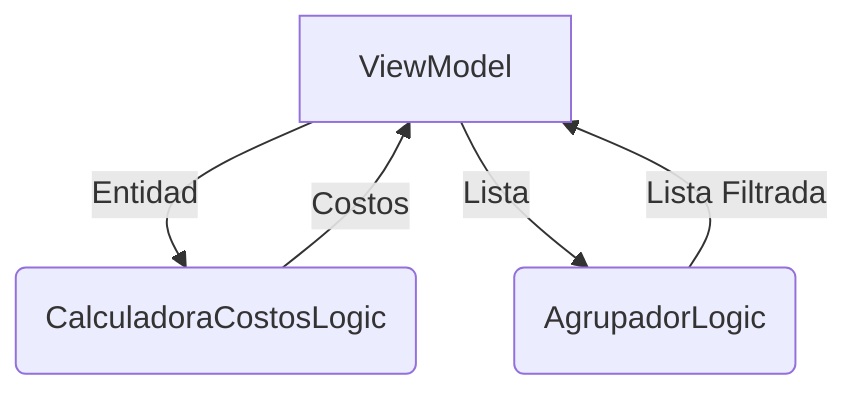

# Lógica de Negocio

## Estructura
```
lib/logics/
├── agrupador_logic.dart
├── calculadora_costos_logic.dart
```

## CalculadoraCostosLogic
```dart
class CalculadoraCostosLogic {
  // Input: Evento
  // Output: Map<String, double> con costos detallados
  Map<String, double> calcularCostoEvento(Evento evento) {
    // Implementación...
  }

  // Input: Plato
  // Output: double con costo total
  double calcularCostoPlato(Plato plato) {
    // Implementación...
  }

  // Input: Intermedio
  // Output: double con costo total  
  double calcularCostoIntermedio(Intermedio intermedio) {
    // Implementación...
  }
}
```
**Responsabilidad**: Calcula costos para eventos, platos e intermedios.

**Flujo**:
1. Recibe entidades completas como input
2. Calcula costos recursivamente
3. Retorna mapas/doubles con resultados

## AgrupadorLogic
```dart
class AgrupadorLogic {
  // Input: List<Plato>, String categoria
  // Output: List<Plato> filtrados
  List<Plato> filtrarPorCategoria(List<Plato> platos, String categoria) {
    // Implementación...
  }

  // Input: List<Evento>, TipoEvento tipo  
  // Output: List<Evento> filtrados
  List<Evento> filtrarEventosPorTipo(List<Evento> eventos, TipoEvento tipo) {
    // Implementación...
  }
}
```
**Responsabilidad**: Filtrado y agrupamiento de entidades.

**Características**:
- Operaciones sincrónicas
- Puramente lógica (sin estado)
- Reutilizable en múltiples ViewModels

## Diagrama de Flujo

