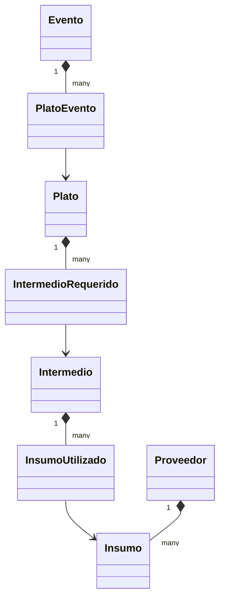

# Modelos

## Modelos Principales

### 1. Plato
```dart
class Plato {
  String id;
  String codigo;
  String nombre;
  String descripcion;
  List<String> categorias;
  double costoTotal;
  double precioVenta;
  List<IntermedioRequerido> intermedios;
  bool activo;
  DateTime? fechaCreacion;
  DateTime? fechaActualizacion;
}
```
**Descripción**: Representa un plato del menú con su información básica, categorización, costos y fechas de creación y actualización.

### 2. Evento
```dart
class Evento {
  String id;
  String codigo;
  String nombreCliente;
  DateTime fecha;
  TipoEvento tipo;
  EstadoEvento estado;
  List<String> platosId;
  Map<String, dynamic> detalles;
}
```
**Descripción**: Gestiona eventos y reservaciones del restaurante.

### 3. Intermedio
```dart
class Intermedio {
  String id;
  String nombre;
  String descripcion;
  List<InsumoUtilizado> insumos;
}
```
**Descripción**: Representa preparaciones intermedias utilizadas en platos.

### 4. IntermedioRequerido
```dart
class IntermedioRequerido {
  String platoId;
  String intermedioId;
  double cantidad;
}
```
**Descripción**: Enlaza preparaciones intermedias con platos.

### 5. InsumoUtilizado
```dart
class InsumoUtilizado {
  String insumoId;
  String intermedioId;
  double cantidad;
  UnidadMedida unidad;
}
```
**Descripción**: Enlaza ingredientes con preparaciones intermedias.

### 6. PlatoEvento
```dart
class PlatoEvento {
  String platoId;
  String eventoId;
  int cantidad;
}
```
**Descripción**: Enlaza platos con eventos con sus respectivas cantidades.

### 7. Proveedor
```dart
class Proveedor {
  String id;
  String nombre;
  String contacto;
  List<String> insumosProveidos;
}
```
**Descripción**: Representa proveedores de ingredientes.

### 8. Insumo
```dart
class Insumo {
  String id;
  String nombre;
  double precioUnitario;
  UnidadMedida unidadBase;
}
```
**Descripción**: Representa ingredientes crudos con precios.

## Relaciones entre Modelos

1. **Plato -> IntermedioRequerido**
   - Un plato puede tener múltiples preparaciones intermedias requeridas
   - Cada preparación intermedia está enlazada a un plato específico a través de `platoId`

2. **Intermedio -> InsumoUtilizado**
   - Cada preparación intermedia puede tener múltiples ingredientes
   - Los ingredientes están enlazados a su preparación intermedia a través de `intermedioId`

3. **Evento -> PlatoEvento**
   - Un evento puede tener múltiples platos
   - Cada plato está enlazado a un evento a través de `eventoId`

4. **PlatoEvento -> Plato**
   - Enlaza platos de eventos con sus definiciones de platos originales
   - Mantiene la cantidad de cada plato en el evento

## Enumeraciones

### TipoEvento
```dart
enum TipoEvento {
  matrimonio,
  produccionAudiovisual,
  chefEnCasa,
  institucional
}
```

### EstadoEvento
```dart
enum EstadoEvento {
  cotizado,
  confirmado,
  esCotizacion,
  enPruebaMenu,
  completado,
  cancelado
}
```

### UnidadMedida
```dart
enum UnidadMedida {
  gramos,
  kilogramos,
  litros,
  unidades
}
```

## Relaciones entre Modelos (Diagrama)


## Flujo de Cálculo de Costos

El sistema de cálculo de costos es ahora jerárquico e integrado en la estructura del modelo:

1. **Nivel de Ingrediente (InsumoUtilizado)**
   - Cada ingrediente tiene un precio unitario
   - El costo se calcula como `cantidad * precioUnitario`

2. **Nivel de Intermedio (IntermedioRequerido)**
   - Suma los costos de todos los ingredientes
   - Costo total = suma de todos los costos de ingredientes

3. **Nivel de Plato (Plato)**
   - Suma los costos de todos los intermedios requeridos
   - Aplica un margen del 30% para obtener el precio de venta final

Este enfoque jerárquico proporciona una forma más precisa y mantenible de calcular costos directamente desde los ingredientes y intermedios utilizados en cada plato.

## Métodos
- `crear`: Factory constructor con validación de campos
- `fromFirestore`: Constructor para crear instancia desde documento Firestore
- `fromMap`: Constructor para crear instancia desde Map
- `toFirestore`: Convierte la instancia a Map para Firestore
- `copyWith`: Crea una copia con campos actualizados
- `==` y `hashCode`: Implementación de equidad
- `toString`: Representación en string del objeto

## Validaciones
- `intermedioId` no puede estar vacío
- `codigo` no puede estar vacío
- `nombre` no puede estar vacío
- `cantidad` debe ser positiva
