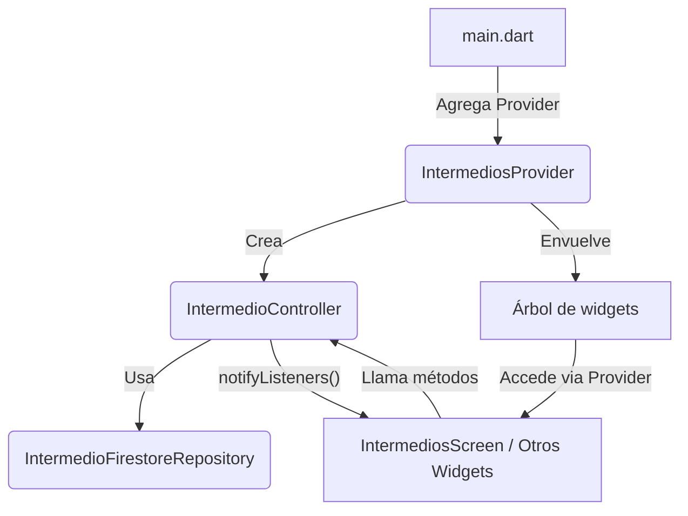

# Uso de Provider para el Catálogo de Intermedios en Golo App

## ¿Por qué se creó un Provider dedicado?

El patrón Provider en Flutter es una solución recomendada para la gestión de estado reactivo y la inyección de dependencias. En el caso del catálogo de intermedios, se creó un Provider específico para:

- **Centralizar la lógica de negocio y el estado** del catálogo (lista de intermedios, operaciones CRUD, loading, errores).
- **Permitir acceso global** al controlador desde cualquier pantalla o widget descendiente.
- **Facilitar la reactividad**: cuando el estado cambia (por ejemplo, se agrega o elimina un intermedio), la UI se actualiza automáticamente.
- **Separar responsabilidades**: la UI no se encarga de la lógica de datos ni de la comunicación con Firestore.

## ¿Cómo funciona?

1. **Inyección de dependencia**: El Provider crea una instancia de `IntermedioController` y la pone a disposición de todo el árbol de widgets.
2. **Acceso reactivo**: Cualquier widget puede acceder al controlador usando `Provider.of<IntermedioController>(context)` o el widget `Consumer`.
3. **Notificación de cambios**: Cuando el controlador llama a `notifyListeners()`, todos los widgets que dependen de él se reconstruyen automáticamente.

---

## Diagrama de flujo de uso

---

## Ejemplo de flujo

1. **main.dart** envuelve la app con `IntermediosProvider`.
2. `IntermediosProvider` crea una instancia de `IntermedioController`.
3. El controlador usa el repositorio para obtener los datos de Firestore.
4. Cualquier pantalla (por ejemplo, `IntermediosScreen`) accede al controlador y muestra la lista de intermedios.
5. Si se agrega, edita o elimina un intermedio, el controlador actualiza el estado y notifica a la UI.

---

## Ventajas
- Código más limpio y desacoplado.
- Fácil de escalar a otros catálogos o módulos.
- Reactividad automática: la UI siempre refleja el estado actual de los datos.

---

> **En resumen:** El Provider permite que la lógica y estado de los intermedios esté centralizada, accesible y reactiva en toda la app, siguiendo buenas prácticas de arquitectura MVVM y Flutter.
